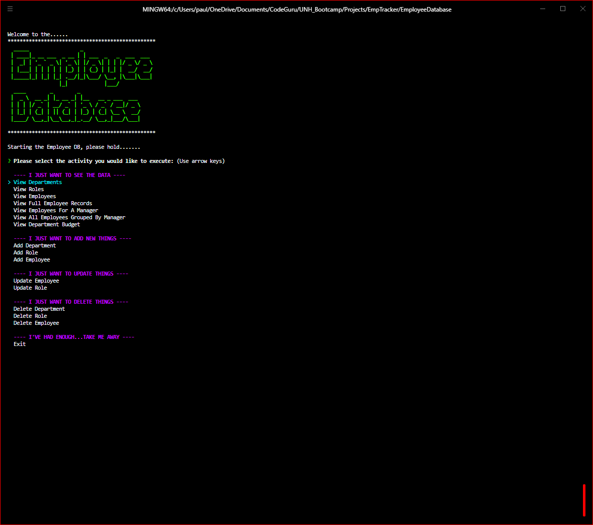
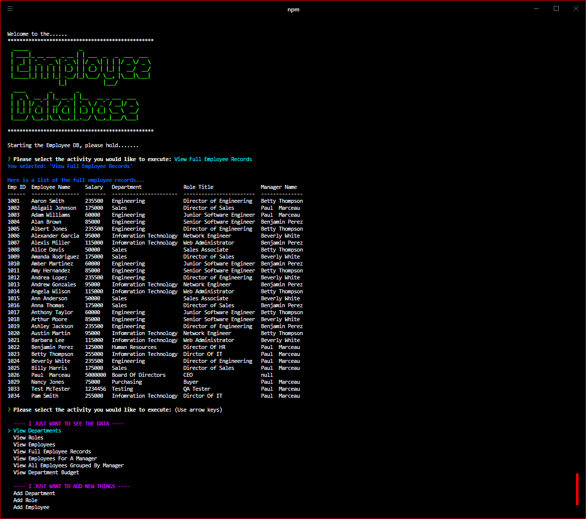
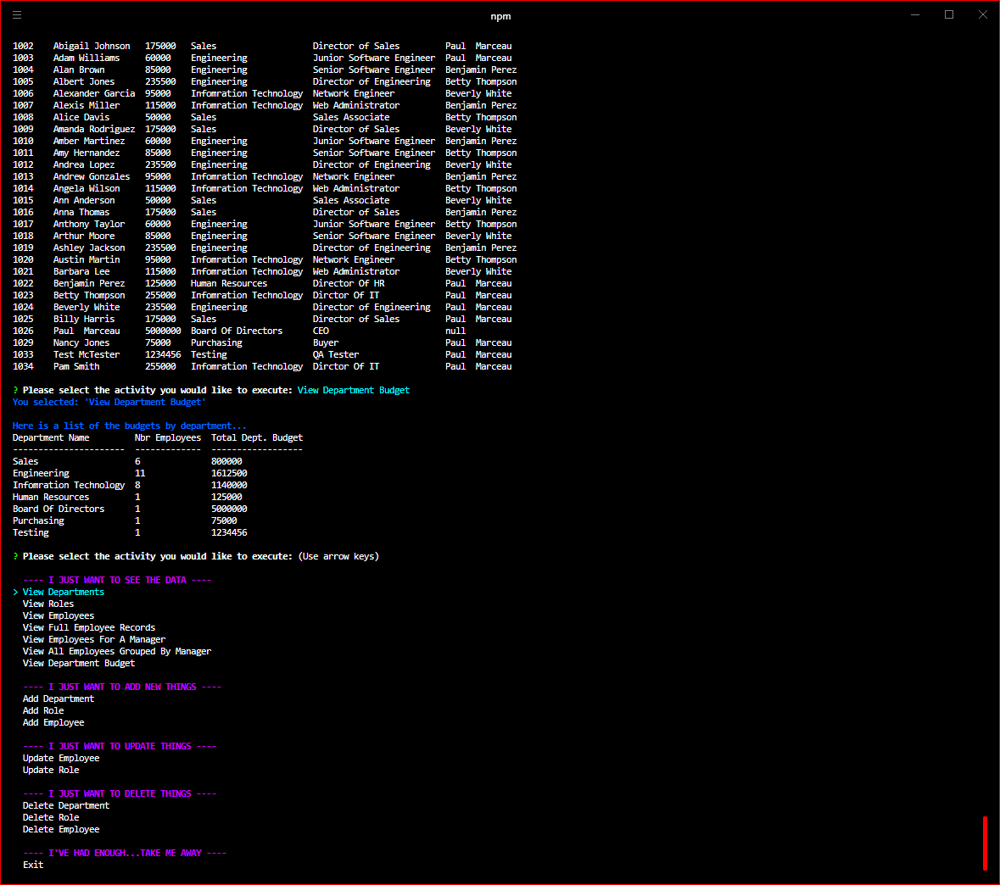

# **NODE: Employee Tracker**

## **Description**

Developers are often tasked with creating interfaces that make it easy for non-developers to view and interact with information stored in databases. Often these interfaces are known as Content Management Systems. In this homework assignment, your challenge is to architect and build a solution for managing a company's employees using node, inquirer, and MySQL.

## Table of Contents

- [User Story](#user-story)
- [Acceptance Criteria](#acceptance-criteria)
- [Installation](#installation)
- [Usage](#usage)
- [Required](#required)
- [Testing](#testing)
- [Questions And Support](#questions-and-support)
- [Contributors](#contributors)
- [Deployed Link](#deployed-link)
- [Media Links](#media-links)
- [License](#license)

---

## **User** **Story**

As a business owner I want to be able to view and manage the departments, roles, and employees in my company So that I can organize and plan my business

## **Acceptance** **Criteria**

Build a command-line application that at a minimum allows the user to: - Add departments, roles, employees - View departments, roles, employees - Update employee roles  Bonus points if you're able to: - Update employee managers - View employees by manager - Delete departments, roles, and employees - View the total utilized budget of a department -- ie the combined salaries of all employees in that department

## **Installation**

-Steps to install + Install Node.js + Clone repository to your local machine + Run "npm install" to install all dependencies

## **Usage**

You will start the application by typing "npm start" in the command line. You will be presented with a list of options to choose from. Each option executes a different function. Choose the functions you would like to execute.

## **Media** **Links**

## Main Screenshot

## All Employees View

## Budget By Department

## Full Demo video link:

Link1: All Views, Adds and Updates: 
https://drive.google.com/file/d/1oOV4vtnd2d9CfYdQVQDLwuJx1JrqkHT5/view?usp=sharing

Link2: All Deletes: 
https://drive.google.com/file/d/1KcOQOJwwCLT6ys81enKwPz1W4BnilQLq/view?usp=sharing

## **Required**

The following NODE modules are required: + figlet + Inquirer + MySQL + ansi-colors + console.table

## **Testing**

Each function was executed and tested

## **Questions** **And** **Support**

If you have any questions about the application or the repository, please open an [issue](https://github.com/pmarceaujr/EmployeeDatabase/issues) or contact me via email at paul@marceaus.net.  
 You can find more of my work on my [GitHub](https://github.com/pmarceaujr).

## **Contributors**

NO other contributors at this time

## **Deployed** **Link**

No web deployment link for this app

## **License**

This project is licensed under the [MIT License](https://choosealicense.com/licenses/mit).
